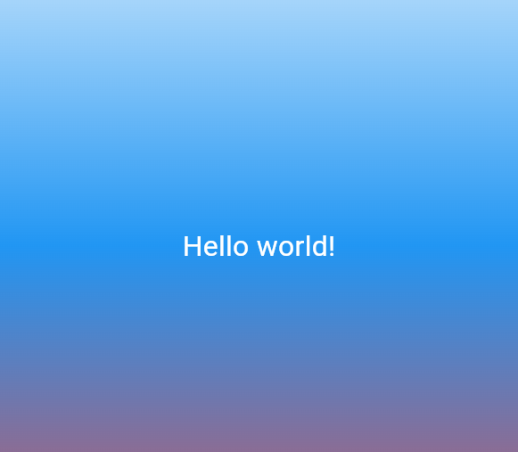

# First Flutter App — Flutter Lab 2

Flutter-приложение с градиентным фоном, написанное с нуля.

## Автор

- ФИО: Уютов Павел Александрович 
- Группа: ИСП-231

## Стек и версии

- Flutter 3.44.0
- Dart 3.12.0
- Платформа: Web (Edge)
- IDE: VS Code

## Скриншот приложения

## Как запустить

1. Клонировать репозиторий
2. Перейти в папку проекта
3. Выполнить `flutter pub get`
4. Запустить командой `flutter run -d edge`

## Что изучили

- Структура Flutter-проекта
- Виджеты: MaterialApp, Scaffold, Center, Container, Text
- Дерево виджетов и как оно строится
- Hot Reload и Hot Restart — разница и применение
- Стилизация текста через TextStyle
- Градиентный фон через BoxDecoration и LinearGradient